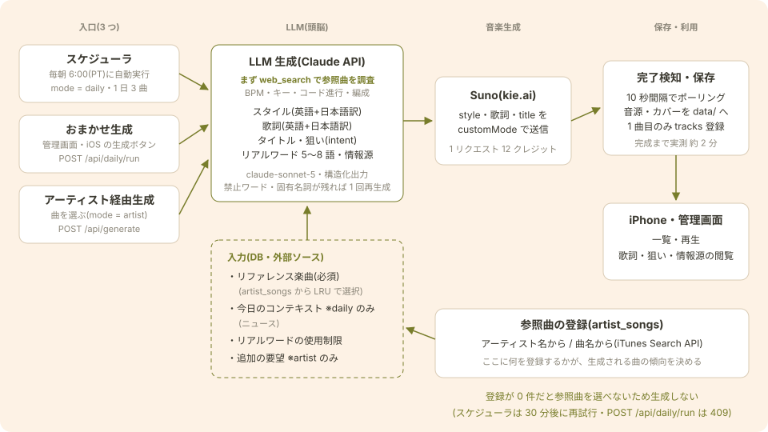
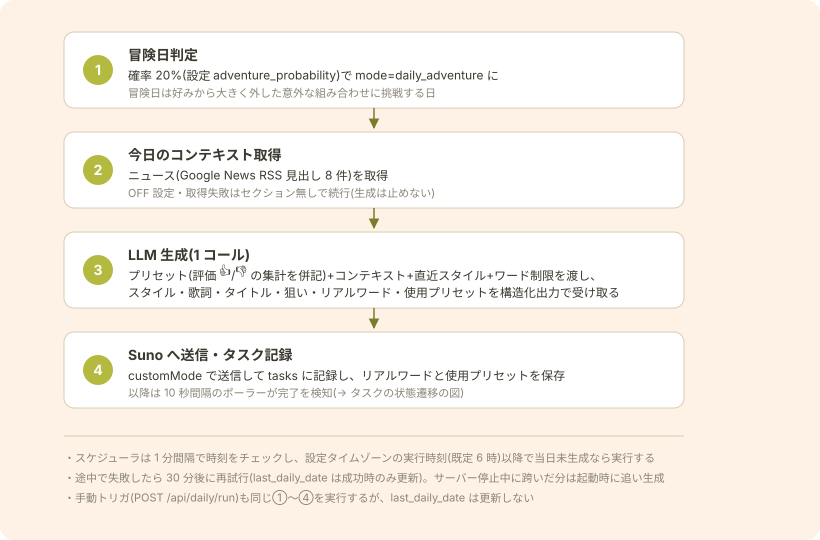
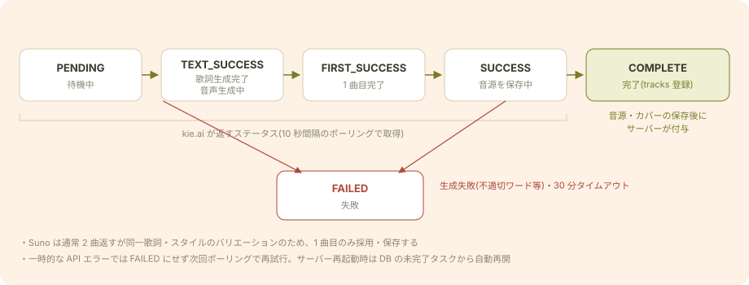

# 音楽生成の流れ

現在の実装が実際にどう動くかを図で説明する文書。設計決定の経緯・理由・データモデルは [music-generation.md](music-generation.md) を参照(この文書は挙動の説明に徹し、決定の記録は持たない)。

対応するコード: `server/src/scheduler.ts`(毎日の自動生成)/ `llm.ts`(LLM 呼び出し)/ `context.ts`(ニュース)/ `generation.ts`(Suno 送信・完了検知)/ `suno/kieai.ts`(プロバイダ実装)。

## 全体像

入口は 3 つあるが、どれも同じパイプラインに合流する: **LLM(Claude API)がスタイル・歌詞などの「曲のプラン」を作り、Suno に `customMode: true` で渡す**。生成に使ったプリセットはタスク単位で記録され、完成した曲への評価(👍/👎)はプリセット別の集計として次回生成のプロンプトに注入され、毎日の生成が良くなっていくループになっている。

## 生成の入口(3 つ)

| 入口 | mode | 評価集計の注入 | 今日のコンテキスト | LLM への指示 |
|---|---|---|---|---|
| 毎日の自動生成(スケジューラ) | `daily` / `daily_adventure` | あり | あり | プリセット全プールから評価集計を踏まえて選ぶ。通常日は「👍 優先・👎 回避+1 要素だけ普段と違うもの」、冒険日は「集計に従わなくてよい・大きく外す」。1 日の曲数(`daily_count`、既定 3)の分だけ 1 曲ずつ順次生成する |
| おまかせ生成(管理画面・iOS → `POST /api/daily/run`) | 同上 | あり | あり | 同上(スケジューラの 1 曲分と同じ手順を実行。ただし `last_daily_date` / `last_daily_count` は更新しないため、当日のスケジュール実行は別途走る) |
| カスタム生成(iOS → `POST /api/generate`) | `manual` | なし(集計で誘導しない) | なし | ユーザーが選んだプリセット+自由テキストを最優先で反映(リアルワードの禁止ワードよりユーザー指定が勝つ) |

どの入口でも直近スタイル・リアルワード制限は LLM に渡り、使用プリセットの記録と評価の集計反映も共通で働く。

## 毎日の自動生成の手順

上図は 1 曲分の手順。スケジューラは 1 日の曲数(`daily_count`、既定 3)の残数分だけこの手順を 1 曲ずつ順次実行し、成功のたびにその日の生成済み数を `settings`(`last_daily_date` / `last_daily_count`)へ記録する。途中で失敗した場合は 30 分後、サーバー停止中に実行時刻を跨いだ場合は起動時のチェックで、いずれも残数だけ追い生成される(重複生成しない)。冒険日判定は 1 曲ごとに行う。順次実行のため、2 曲目以降のプロンプトには同日の前の曲のスタイル(直近スタイル)とリアルワードが既存の仕組みでそのまま注入され、曲間の重複を避けられる。

実行時刻・タイムゾーン・冒険日確率・1 日の曲数・ニュースの ON/OFF は `settings` テーブルで持ち、管理画面の設定ページと iOS の設定タブ(`GET/PUT /api/settings`)から変更できる(次の生成から反映)。

## LLM 生成の入出力

LLM への入力(user メッセージ)は次のセクションを組み立てて 1 回で渡す。実際に送った全文は `tasks.llm_prompt` に保存され、管理画面の楽曲詳細で確認できる。

| セクション | 内容 | 対象モード |
|---|---|---|
| ユーザーが選んだ要素・自由リクエスト | 選択プリセット+自由テキスト(最優先で反映) | manual のみ |
| 利用できる要素プール+モード指示 | プリセット全件(genre・mood・tempo・vocal)にプリセット別の評価集計(👍 N / 👎 N。両方 0 は無印)を併記し、通常日(👍 優先・👎 回避+1 要素は外す)/冒険日(集計に従わなくてよい)の方針を指示 | daily / daily_adventure |
| 今日のコンテキスト | ニュース見出し(Google News RSS 米国版・英語の上位 8 件)。「報告ではなく雰囲気・テーマとして織り込む」と指示 | daily / daily_adventure |
| 直近の生成スタイル | 直近 10 曲の style(重複回避用。1 日 3 曲でも数日分を見渡せる件数) | 全モード |
| 使用禁止ワード/残り 1 回のワード | リアルワードの使用回数集計から算出(下記) | 全モード |
| 出力条件 | インストゥルメンタル指定、歌声の特徴を style に必ず含める指示 | 全モード |

出力は構造化出力(JSON Schema)で受け取る:

| フィールド | 内容 |
|---|---|
| `style` / `styleJa` | Suno に渡す英語スタイルプロンプト(500 文字以内)とその日本語訳 |
| `title` | 曲のタイトル(英語) |
| `lyrics` / `lyricsJa` | セクションタグ付きの英語歌詞と日本語訳(インストは空文字列) |
| `intent` | この曲の狙い(日本語 2〜3 文。管理画面・iOS の楽曲詳細に表示) |
| `realWorldWords` | 曲の中心となった語(英語小文字 5〜8 個)。保存して使用回数制限に使う |
| `usedPresets` | 採用したプリセット(`{category, value}` の配列。提示値を一字一句写す指示)。サーバーで `presets` と照合して `task_presets` に保存し(不一致は警告ログのみ)、manual はユーザー選択との和集合を記録。評価集計の元になり、楽曲詳細の「使用プリセット」に表示 |

### リアルワードの使用制限と検証リトライ

似たテーマの連続生成を防ぐ仕組み(詳細な決定は [music-generation.md](music-generation.md) の「リアルワードの使用制限」)。生成前に直近ウィンドウ(既定 30 日)の使用回数を集計し、上限(既定 2 回)に達した語を「使用禁止ワード」としてプロンプトに注入する。出力の `realWorldWords` に禁止ワードが残っていたら**指示を強めて 1 回だけ再生成**し、それでも残る場合は警告ログのみで採用する(生成は止めない)。

## Suno タスクの状態遷移

LLM のプランは `customMode: true`(style / prompt=歌詞 / title / model)で Suno(kie.ai)へ送信され、`tasks` に記録される。以降は 10 秒間隔のポーラーが進行を追う。

- `SUCCESS` を検知したら**すぐ**音源・カバー画像を `data/` へダウンロードする(プロバイダの URL は一時ファイル置き場のため)。保存が終わると `COMPLETE` になり `tracks` に登録される
- `CALLBACK_EXCEPTION` は曲データがあれば成功扱い、無ければ失敗扱い(完了検知はポーリングで行い、コールバックは使っていない)
- 進行状況は `GET /api/tasks` で取れ、iOS のライブラリ上部カード・生成タブと管理画面が 5 秒ポーリングで表示する

## 評価のフィードバックループ

iPhone・管理画面で付けた 👍/👎 は `tracks.rating` に保存され、次回生成のたびに `task_presets`(その曲の生成に使ったプリセットの記録)と join してプリセット別の 👍/👎 を全期間集計し、要素プールの行に併記して注入する(👍 の多い要素を優先・👎 の多い要素は回避と指示)。集計は保存値を持たないステートレス方式なので、評価の変更・解除が次の生成に即反映される。冒険日の曲も評価対象で、👍 が付けばその要素の集計が上がり以後の通常日に選ばれやすくなる(冒険日自体は集計に従わなくてよいと指示)。プリセット別の集計は presets 管理ページの各行と `GET /api/presets`(`upCount` / `downCount`)で確認できる。

## 関連文書

- [music-generation.md](music-generation.md) — 設計決定の記録(決定事項・データモデル・API・コスト見込み)
- [suno-api.md](suno-api.md) — Suno API(kie.ai / sunoapi.org)の調査・検証
